# Jedis 보다 Lettuce 를 쓰자

Java의 Redis Client는 크게 2가지가 있습니다.

* [Jedis](https://github.com/xetorthio/jedis)
* [Lettuce](https://github.com/lettuce-io/lettuce-core)

둘 모두 몇천개의 Star를 가질만큼 유명한 오픈소스입니다.  
이번 시간에는 둘 중 어떤것을 사용해야할지에 대해 **성능 테스트 결과**를 공유하고자 합니다.

> 모든 코드와 Beanstalk 설정값은 [Github](https://github.com/jojoldu/spring-boot-redis-tip)에 있으니 참고하세요.

> 레디스외 병목현상을 방지하기 위해 Nginx, 커널 파라미터 등은 모두 적절하게 [튜닝](https://github.com/jojoldu/spring-boot-redis-tip/tree/master/.ebextensions)된 상태입니다.

## 0. 프로젝트 환경

의존성 환경은 아래와 같습니다.

* Spring Boot 2.1.4
* Spring Boot Data Redis 2.1.4
* Jedis 2.9.0
* Lettuce 5.1.6

그리고 테스트에 사용될 Redis Entity 코드는 아래와 같습니다.

```java
@ToString
@Getter
@RedisHash("availablePoint")
public class AvailablePoint implements Serializable {

    @Id
    private String id; // userId
    private Long point;
    private LocalDateTime refreshTime;

    @Builder
    public AvailablePoint(String id, Long point, LocalDateTime refreshTime) {
        this.id = id;
        this.point = point;
        this.refreshTime = refreshTime;
    }
}
```

```java
public interface AvailablePointRedisRepository extends CrudRepository<AvailablePoint, String> {
}
```

임의의 데이터를 저장하고, 가져올 ```Controller``` 코드는 아래와 같습니다.

```java
@Slf4j
@RequiredArgsConstructor
@RestController
public class ApiController {
    private final AvailablePointRedisRepository availablePointRedisRepository;

    @GetMapping("/")
    public String ok () {
        return "ok";
    }

    @GetMapping("/save")
    public String save(){
        String randomId = createId();
        LocalDateTime now = LocalDateTime.now();

        AvailablePoint availablePoint = AvailablePoint.builder()
                .id(randomId)
                .point(1L)
                .refreshTime(now)
                .build();

        log.info(">>>>>>> [save] availablePoint={}", availablePoint);

        availablePointRedisRepository.save(availablePoint);

        return "save";
    }


    @GetMapping("/get")
    public long get () {
        String id = createId();
        return availablePointRedisRepository.findById(id)
                .map(AvailablePoint::getPoint)
                .orElse(0L);
    }

    // 임의의 키를 생성하기 위해 1 ~ 1_000_000_000 사이 랜덤값 생성
    private String createId() {
        SplittableRandom random = new SplittableRandom();
        return String.valueOf(random.nextInt(1, 1_000_000_000));
    }
}
```

위 ```/save``` API를 통해 테스트할 데이터를 Redis에 적재해서 사용합니다.  
성능 테스트는 ```/get``` API를 통해 진행합니다.  

### 0-1. EC2 사양

Spring Boot가 실행되고 Redis로 요청할 EC2의 사양은 아래와 같습니다.

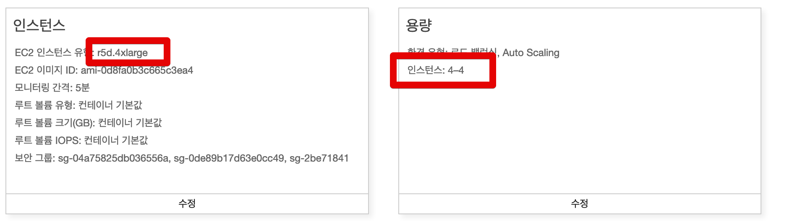

(최대한 Redis 자원을 사용하기 위해 높은 사양을 선택했습니다.)

* r5d.4xLarge X 4대

### 0-2. Redis 사양

테스트에 사용될 Redis (Elastic Cache) 의 사양은 아래와 같습니다.


* R5.large
* Redis 5.0.3

테스트용 데이터는 대략 **1천만건**을 적재하였습니다.

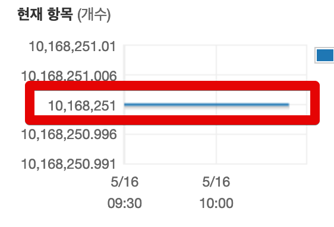

그리고 성능 테스트와 모니터링은 네이버의 두 제품을 사용합니다.

* [Pinpoint](https://github.com/naver/pinpoint)
* [Ngrinder](https://naver.github.io/ngrinder/)

자 그럼 먼저 Jedis를 테스트해보겠습니다.

## 1. Jedis

Jedis는 예전부터 Java의 표준 Redis Client로 사용되었습니다.  
그래서 대부분의 Java & Redis 예제가 Jedis로 되어 있는데요.  
Spring Boot에서는 다음과 같은 의존성 설정이 필요합니다.  

```groovy
dependencies {
    compile group: 'it.ozimov', name: 'embedded-redis', version: '0.7.2'

    // jedis
    compile group: 'redis.clients', name: 'jedis'
    compile group: 'org.apache.commons', name: 'commons-pool2', version: '2.6.2'
    compile ('org.springframework.boot:spring-boot-starter-data-redis') {
        exclude group: 'io.lettuce', module: 'lettuce-core'
    }

    implementation 'org.springframework.boot:spring-boot-starter-actuator'
    implementation 'org.springframework.boot:spring-boot-starter-web'
    compileOnly 'org.projectlombok:lombok'
    annotationProcessor 'org.projectlombok:lombok'
    testImplementation 'org.springframework.boot:spring-boot-starter-test'
}

```

build.gradle에서는 **기본 의존성인 lettuce를 제거**하고 Jedis를 등록합니다.

> Spring Boot 2.0이 되고 lettuce가 기본 클라이언트가 되어서 아래와 같이 제거해야만 합니다.

정상적으로 수행하셨다면 첫번째 테스트인 **Connection Pool 설정 없이** 테스트 해보겠습니다.

### 1-1. Not Connection Pool

Connection Pool 세팅 없이 기본적인 Jedis 설정만 사용하겠습니다.

```java
@RequiredArgsConstructor
@Configuration
@EnableRedisRepositories
public class RedisRepositoryConfig {
    private final RedisProperties redisProperties;

    //jedis
    @Bean
    public RedisConnectionFactory redisConnectionFactory() {
        return new JedisConnectionFactory(new RedisStandaloneConfiguration(redisProperties.getHost(), redisProperties.getPort()));
    }

    @Bean
    public RedisTemplate<?, ?> redisTemplate() {
        RedisTemplate<byte[], byte[]> redisTemplate = new RedisTemplate<>();
        redisTemplate.setConnectionFactory(redisConnectionFactory());
        return redisTemplate;
    }
}
```

다 설정하셨다면 성능 테스트를 시작해보겠습니다.

> 참고로 모든 테스트는 [JVM의 Warm up Time](https://dzone.com/articles/why-many-java-performance-test)을 고려하여 2번이상 테스트하였습니다.

VUser 740명으로 시도합니다.

* agent는 5대
* 각 agent 별 148명을 지정했습니다.
* 부하 테스트 시간은 3분

#### 성능 테스트 결과

부하를 주는 Ngrinder의 Agent는 평균 CPU가 15 ~ 17%를 유지했습니다.

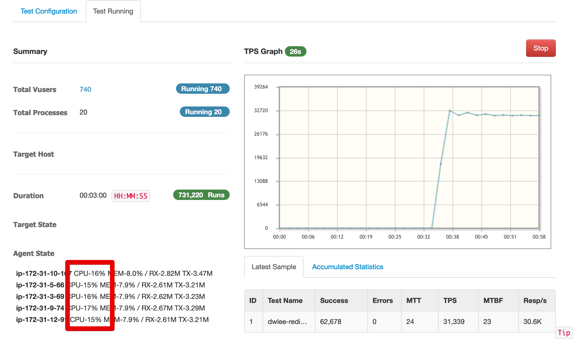

> 높을수록 **단기간에 많은 요청을 주고 받았다**를 의미합니다.

**TPS**는 **3만**이 나왔습니다.  


핀포인트로 측정한 **응답속도** 는 **100ms**가 나왔습니다.

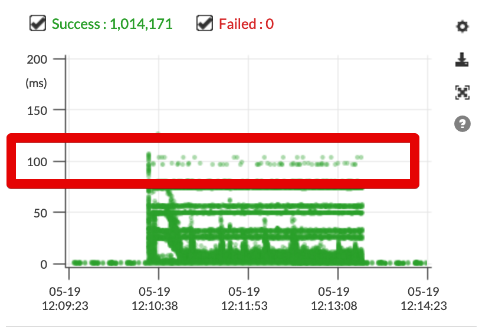

그리고 Redis의 Connection 개수는 35개를 유지했습니다.

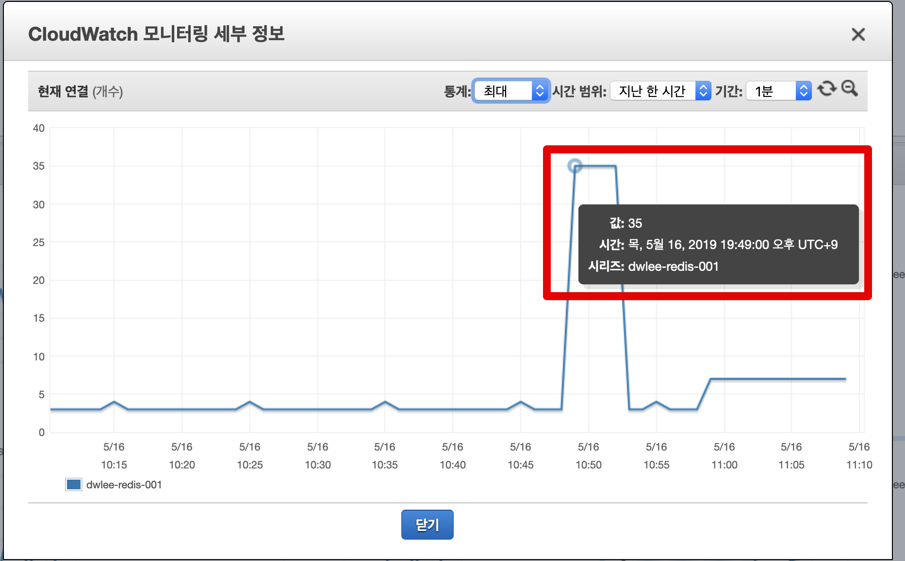

마지막으로 Redis의 CPU는 **20**%가 최고치였습니다.

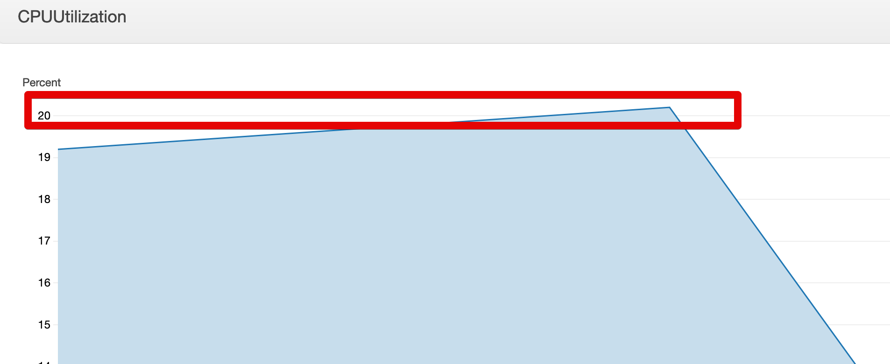


생각보다 성능이 잘나오지 않은것 같죠?  
  
부하를 주는 Ngrinder의 Agent CPU가 20%를 넘지 못했습니다.  
즉, **Redis 응답속도가 좀 더 높다면 훨씬 더 높은 TPS**가 나올수 있다는 이야기입니다.  
  
자 그럼 같은 사양으로 **Connection Pool**을 적용해보겠습니다.

### 1-2. Use Connection Pool

첫번째 테스트로 Connection Pool 없이 진행하니 다음과 같은 결과를 얻었습니다.

* TPS가 낮게 나왔습니다.
    * 응답속도가 높습니다.
* Redis Connection과 EC2 서버의 CPU가 여유로웠습니다.
* Ngrinder의 Agnet CPU가 여유로웠습니다.


그래서 두번째 테스트로 **Jedis에서 Connection Pool 설정**을 추가하고 진행해보겠습니다.  
  
첫번째 테스트에서 만든 ```RedisRepositoryConfig.java```에 아래와 같은 설정을 추가하겠습니다.

```java
    @Bean
    public RedisConnectionFactory redisConnectionFactory() {
        RedisStandaloneConfiguration config = new RedisStandaloneConfiguration(redisProperties.getHost(), redisProperties.getPort());
        JedisConnectionFactory jedisConnectionFactory = new JedisConnectionFactory(config);
        jedisConnectionFactory.setPoolConfig(jedisPoolConfig());
        return jedisConnectionFactory;
    }

    private JedisPoolConfig jedisPoolConfig() {
        final JedisPoolConfig poolConfig = new JedisPoolConfig();
        poolConfig.setMaxTotal(128);
        poolConfig.setMaxIdle(128);
        poolConfig.setMinIdle(36);
        poolConfig.setTestOnBorrow(true);
        poolConfig.setTestOnReturn(true);
        poolConfig.setTestWhileIdle(true);
        poolConfig.setMinEvictableIdleTimeMillis(Duration.ofSeconds(60).toMillis());
        poolConfig.setTimeBetweenEvictionRunsMillis(Duration.ofSeconds(30).toMillis());
        poolConfig.setNumTestsPerEvictionRun(3);
        poolConfig.setBlockWhenExhausted(true);
        return poolConfig;
    }
```

Connection Pool 옵션을 넣고, 다시 성능 테스트를 시작해보면!  
  
TPS는 **5.2만**이 나왔습니다.  

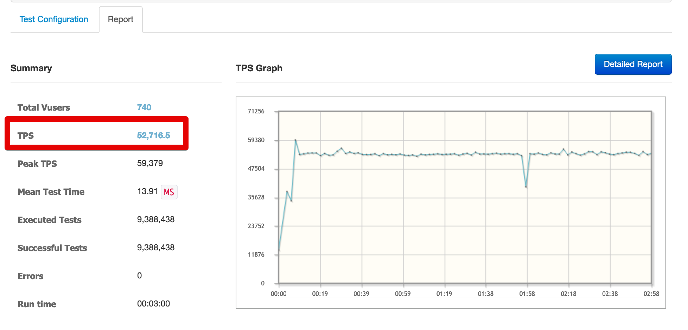

핀포인트 결과는 평균 **50ms**가 나왔습니다.

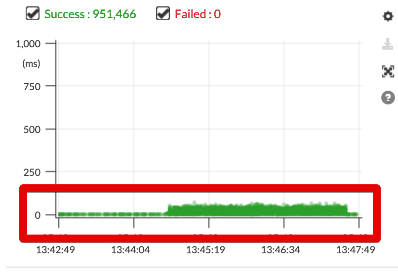

그리고 Redis의 Connection 수가 **515**개로 첫번째 대비 10배이상 높아졌습니다.  

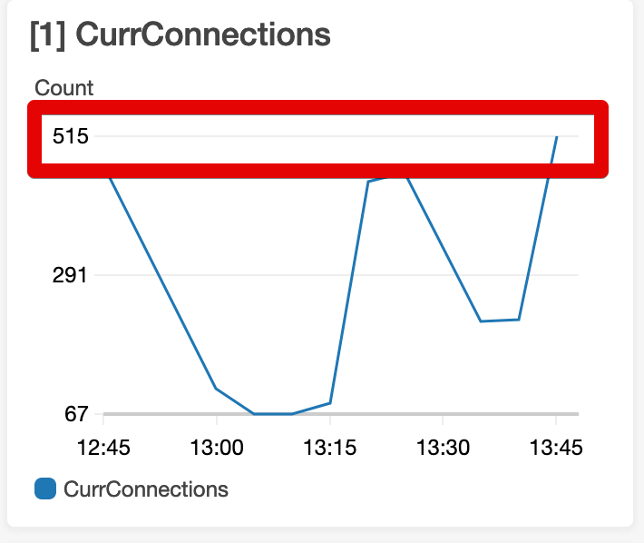

Redis의 CPU 역시 3배이상 올라 **69.5**%를 유지했습니다.

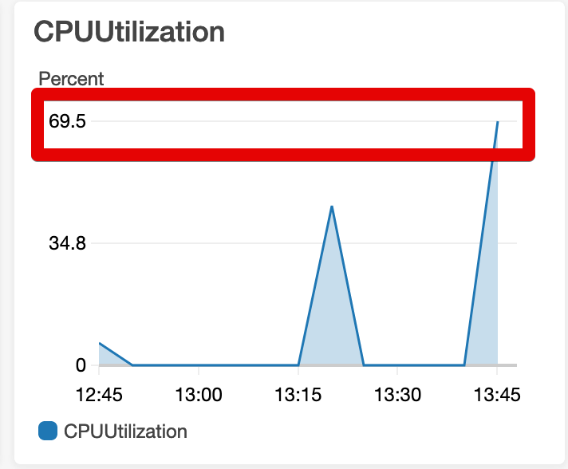

Connection Pool을 적용하고 TPS가 전보다 50%이상 향상되었습니다.  
그렇지만!  
  
문제는 **이보다 더 높은 TPS를 맞추려면 Redis의 CPU가 90%를 넘을수도** 있습니다.  
  
이건 충분히 문제가 되겠죠?  

Jedis를 **꼭** 써야한다면 성능 테스트를 통해 **적절한 Pool Size**를 찾아보셔야만 합니다.


> 제가 사내 시스템에 Redis를 적용하던 시점에는 Jedis가 더이상 업데이트되지 않고 있었습니다.  
2016년 9월이후로 더이상 릴리즈 되지 않다가, 2018년 11월부터 다시 릴리즈가 되고 있습니다.  
혹시나 jedis를 사용하실 분들은 [릴리즈 노트](https://github.com/xetorthio/jedis/releases)를 참고해보세요.

마지막으로 Lettuce를 적용해서 테스트해보겠습니다.

## 2. Lettuce


Lettuce는 Netty (**비동기 이벤트 기반 고성능 네트워크 프레임워크**) 기반의 Redis 클라이언트입니다.  
비동기로 요청을 처리하기 때문에 **고성능을 자랑**합니다.  
  
자 그럼 Lettuce 로 코드를 변경해서 다시 테스트를 진행해보겠습니다.  
  
RedisRepositoryConfig 설정 코드는 아래와 같습니다.


```java
@RequiredArgsConstructor
@Configuration
@EnableRedisRepositories
public class RedisRepositoryConfig {
    private final RedisProperties redisProperties;

    // lettuce
    @Bean
    public RedisConnectionFactory redisConnectionFactory() {
        return new LettuceConnectionFactory(redisProperties.getHost(), redisProperties.getPort());
    }

    @Bean
    public RedisTemplate<?, ?> redisTemplate() {
        RedisTemplate<byte[], byte[]> redisTemplate = new RedisTemplate<>();
        redisTemplate.setConnectionFactory(redisConnectionFactory());
        return redisTemplate;
    }
}
```

build.gradle 에서는 편하게 spring-data-redis만 추가하면 기본의존성으로 사용됩니다.

```groovy
dependencies {
    compile group: 'it.ozimov', name: 'embedded-redis', version: '0.7.2'
    // lettuce
    compile ('org.springframework.boot:spring-boot-starter-data-redis')

    implementation 'org.springframework.boot:spring-boot-starter-actuator'
    implementation 'org.springframework.boot:spring-boot-starter-web'
    compileOnly 'org.projectlombok:lombok'
    annotationProcessor 'org.projectlombok:lombok'
    testImplementation 'org.springframework.boot:spring-boot-starter-test'
}
```

이제 테스트를 해보면!

TPS는 무려 **10만**을 처리합니다.

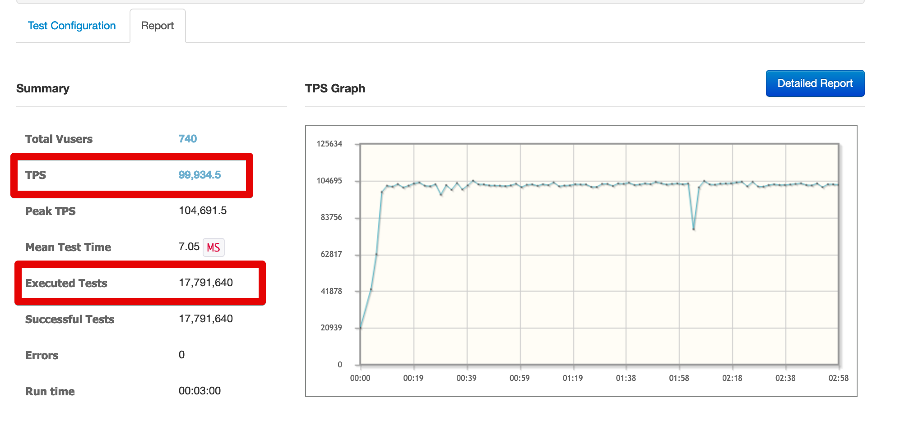

실제로 워낙 빠르게 처리하다보니 **대량의 요청을 해야하는 agent CPU가 70%까지** 올라갔습니다

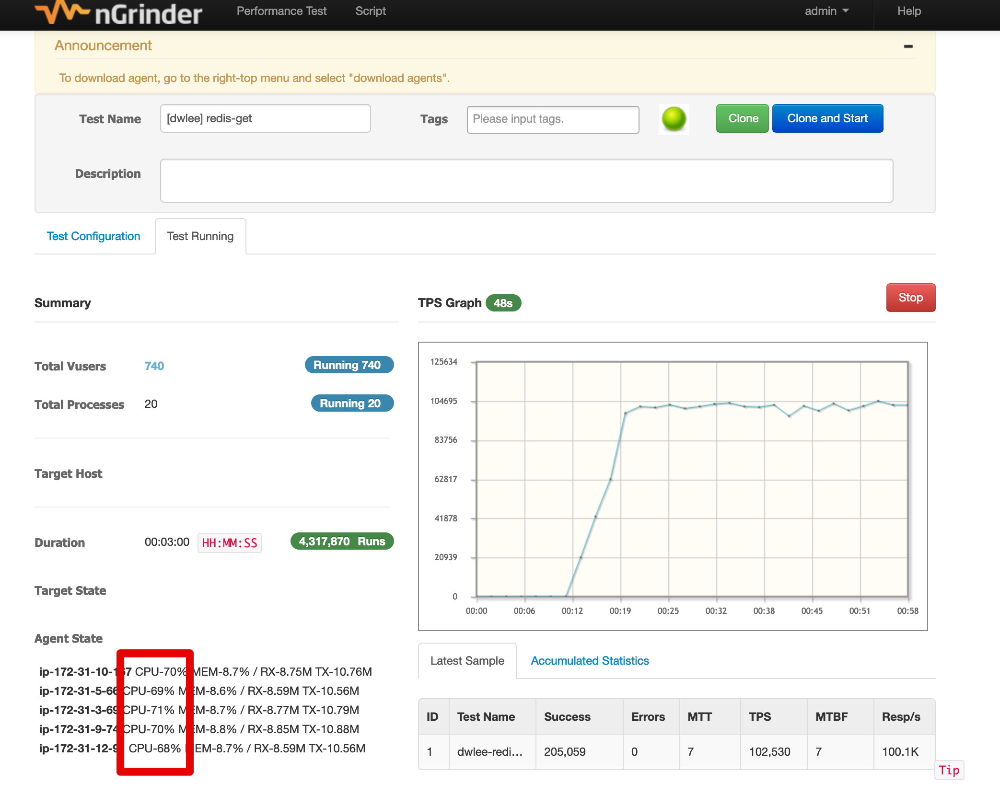

핀포인트의 응답속도는 **7.5**ms 로 아주 고속으로 응답을 주고 있습니다.

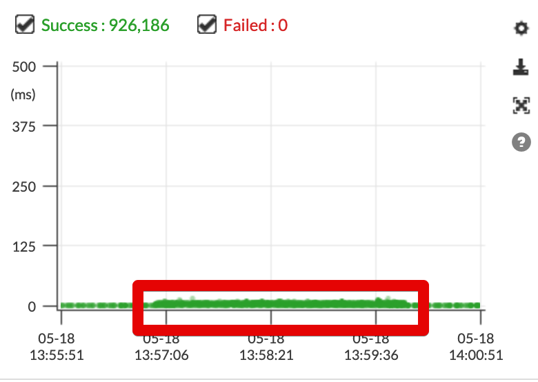

그리고 Redis의 Connection은 **6-7**개를 유지합니다.

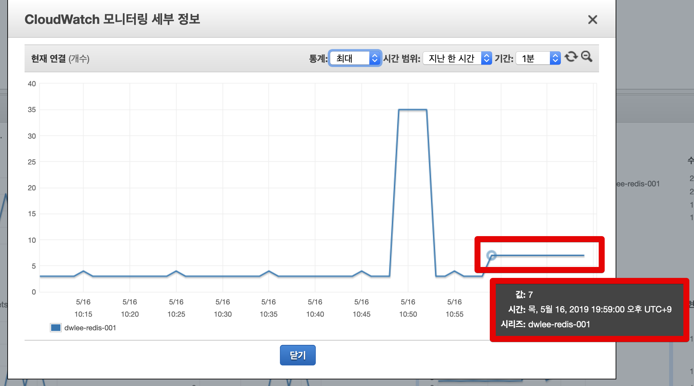

CPU 역시 **7**%밖에 되지 않습니다.

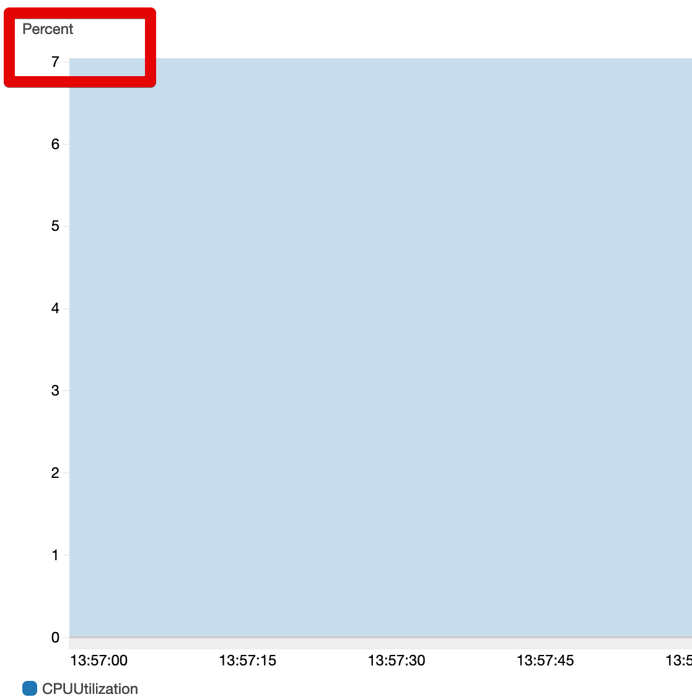

앞에서 진행된 Jedis에 비해 압도적인 성능 차이가 보이시죠?

## 3. 결론

위에서 진행한 3개 테스트에 대한 결과입니다.

|                           | TPS     | Redis CPU | Redis Connection | 응답 속도 |
|---------------------------|---------|-----------|------------------|-----------|
| jedis **no** connection pool  | 31,000  | 20%       | 35               | 100ms     |
| jedis **use** connection pool | 55,000  | 69.5%     | 515             | 50ms |
| lettuce                   | **100,000** | **7**%        | **6**                | **7.5**ms     |

Lettuce는 TPS/CPU/Connection 개수/응답속도 등 **전 분야에서 우위에 있습니다**.  
  
**Lettuce를 사용**합시다.  
  
Jedis에 비해 몇배 이상의 성능과 하드웨어 자원 절약이 가능합니다.  
이외에도 몇가지 이유가 더 있는데요.

* 잘 만들어진 문서
  * [공식 문서](https://lettuce.io/core/release/reference/)
* 깔끔하게 디자인된 코드
  * Jedis의 JedisPool, JedisCluster 등의 여러 생성자들을 보면 어떤걸 써야할지 종잡을수가 없습니다.
* 빠른 피드백
  * Lettuce의 경우 Issue 제기시 당일 혹은 2일안에 피드백을 남깁니다.
  * 반면 Jedis의 경우 **작년까지는 피드백을 거의 주지 않고 있었습니다**
    * 최근엔 피드백 주기가 빨라졌습니다.

## 참고

* [Azure-Redis-Java-Best-Practices.md](https://gist.github.com/warrenzhu25/1beb02a09b6afd41dff2c27c53918ce7#why-lettuce)
* [Why is Lettuce the default Redis client used in Spring Session Redis](https://github.com/spring-projects/spring-session/issues/789)